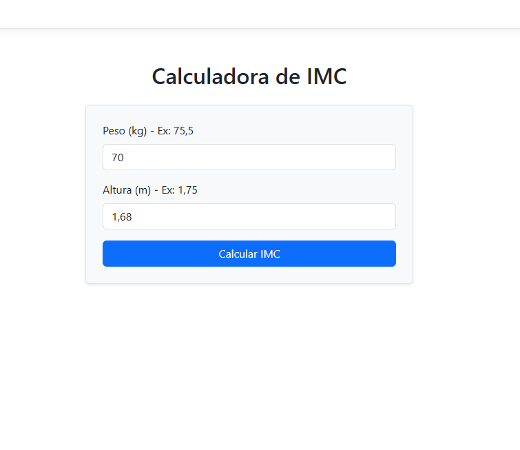

# atividade-vi-lista_produtos

# Calculadora de IMC - ASP.NET Core Core MVC

Este projeto é uma aplicação web desenvolvida em ambiente acadêmico utilizando o padrão arquitetural MVC (Model-View-Controller) com .NET. O objetivo principal é coletar dados de peso e altura do usuário e realizar o cálculo do Índice de Massa Corporal (IMC) inteiramente no lado do servidor (Server-Side).

## O que foi programado e como funciona:

1. **Model (Camada de Dados):** Criei a classe `ImcViewModel` para tipar e validar as entradas do usuário. Utilizei Data Annotations como `[Required]` e `[Range]` para impedir que valores absurdos ou campos vazios quebrem a aplicação, garantindo a integridade dos dados antes do envio.
2. **Controller (Processamento):** No `ImcController`, implementei dois comportamentos (Actions). O método `HttpGet` apenas serve a página inicial limpa. O método `HttpPost` intercepta os dados digitados na View, valida as regras de negócio e executa o cálculo matemático da fórmula do IMC. Com base no resultado numérico, uma estrutura condicional encadeada (`if/else`) classifica o estado do usuário (Abaixo do peso, Peso normal, Sobrepeso ou Obesidade).
3. **View (Interface do Usuário):** Construí uma interface simples e responsiva utilizando HTML5 e componentes do Bootstrap. A página faz o uso de Tag Helpers (`asp-for` e `asp-validation-for`) para ligar os inputs diretamente ao modelo do C#. Quando o servidor devolve o cálculo pronto, a View utiliza uma condicional Razor (`@if`) para renderizar dinamicamente o painel com o resultado final.

## Demonstração da Aplicação Rodando:

